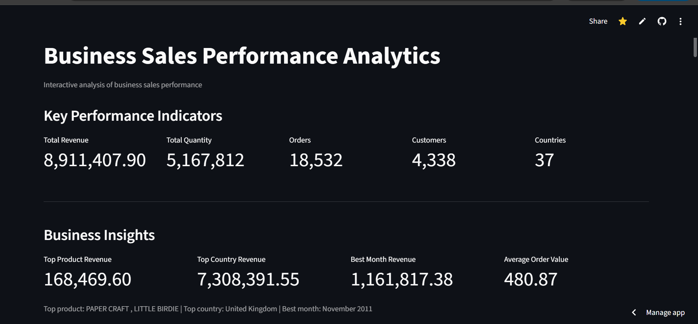
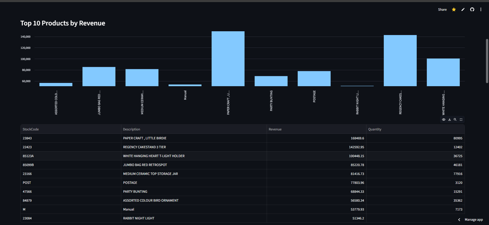
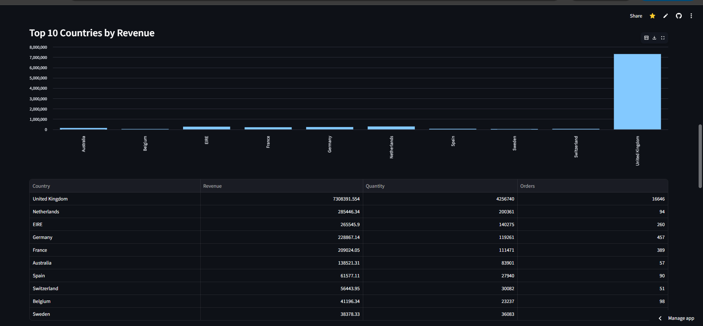
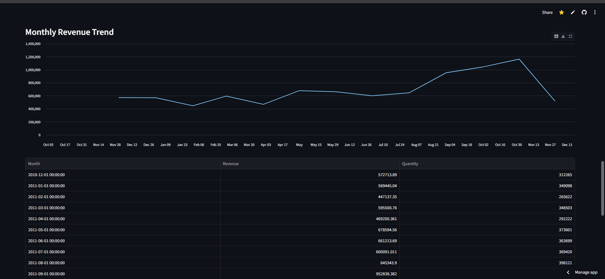

# Business Sales Performance Analytics

An interactive sales analytics dashboard built with Python and Streamlit to analyze business sales performance, identify revenue trends, and generate meaningful business insights from Excel data.

## Live Demo

[View Live Dashboard](https://business-sales-analysis-gj2e5z4fwgfqmqlr5keivp.streamlit.app)

## GitHub Repository

[View Source Code](https://github.com/Naina137/Business-Sales-Analysis)

---

## Project Overview

Business Sales Performance Analytics is an interactive data analysis project that transforms business sales data into meaningful visual insights.

The application uses an Excel workbook as the data source and processes the data using Python and Pandas. The results are presented through an interactive Streamlit dashboard covering overall performance, product revenue, country-wise sales, and monthly trends.

The project focuses on making business sales data easier to explore, understand, and use for data-driven decision making.

---

## Dashboard

The main dashboard provides a quick overview of the overall business performance through key performance indicators and business insights.



### Key Performance Indicators

- Total Revenue
- Total Quantity
- Total Orders
- Total Customers
- Total Countries

The dashboard also highlights the top-performing product, top-performing country, best-performing month, and average order value.

---

## Product Revenue Analysis

The product analysis identifies the top products based on revenue generation and provides a detailed comparison of product performance.



### Analysis Includes

- Top 10 products by revenue
- Product-wise revenue comparison
- Product quantity information
- Revenue contribution of individual products

---

## Country Analysis

The country analysis provides a geographical view of business performance by comparing revenue across different countries.



### Analysis Includes

- Top 10 countries by revenue
- Country-wise revenue comparison
- Quantity sold by country
- Number of orders by country

---

## Monthly Sales Trend

The monthly trend analysis shows how revenue changes over time and helps identify high-performing and low-performing periods.



### Analysis Includes

- Monthly revenue trend
- Monthly quantity trend
- Best-performing month
- Revenue patterns over time

---

## Key Features

- Interactive sales performance dashboard
- KPI-based business overview
- Top 10 product analysis
- Country-wise revenue analysis
- Monthly sales trend analysis
- Business performance insights
- Average Order Value calculation
- Interactive data explorer
- Detailed analysis tables
- CSV download for product analysis
- Excel-based data processing

---

## Dataset

The project uses an Excel workbook containing four analytical sheets:

| Sheet | Description |
|---|---|
| Dashboard | Overall business KPIs and performance summary |
| Top Products | Product-wise revenue and quantity analysis |
| Country Analysis | Country-wise revenue, quantity, and order analysis |
| Monthly Trend | Monthly revenue and quantity trends |

---

## Technologies Used

- Python
- Pandas
- Streamlit
- OpenPyXL
- Microsoft Excel
- GitHub
- Streamlit Community Cloud

---

## Project Structure

```text
Business-Sales-Analysis/
│
├── app.py
├── requirements.txt
├── README.md
├── dashboard.png
├── revenue.png
├── country.png
├── monthly.png
└── Task1_Business_Sales_Analysis-16 (1).xlsx
